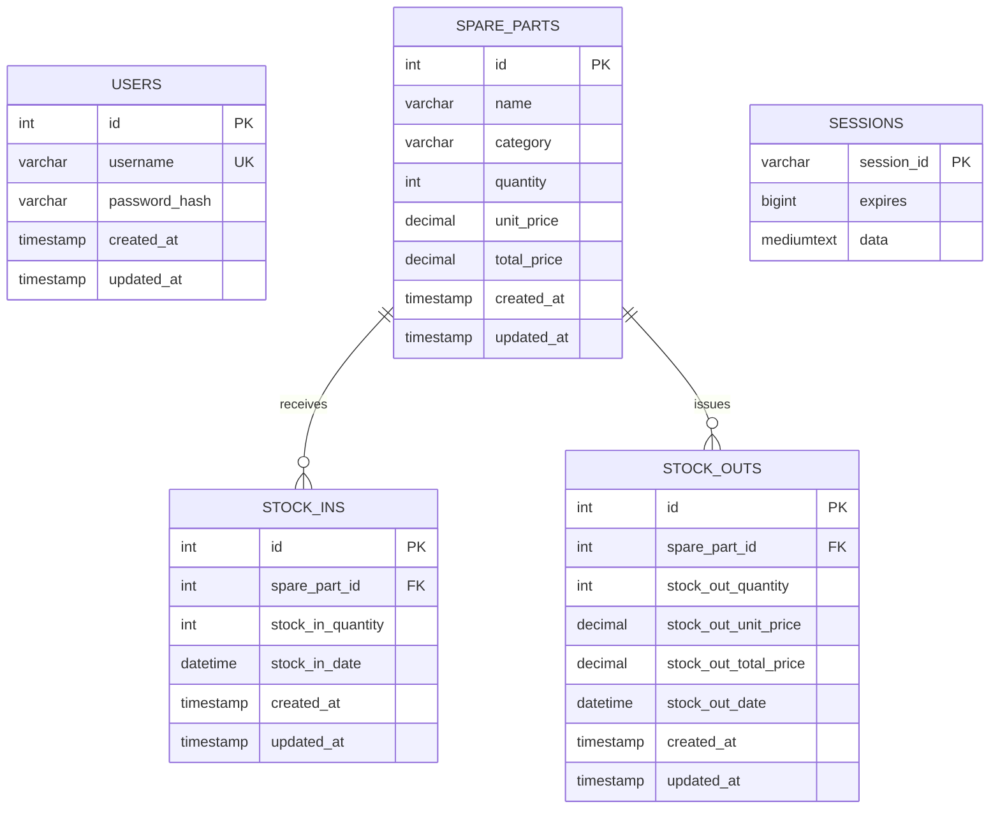

# SIMS MySQL ERD

## Relationship Summary

- One `spare_parts` record can have many `stock_ins` records.
- One `spare_parts` record can have many `stock_outs` records.
- `users` stores login accounts.
- `sessions` stores Express session data for logged-in users.
- `spare_parts.name` and `spare_parts.category` are unique together to prevent duplicate spare-part entries.
